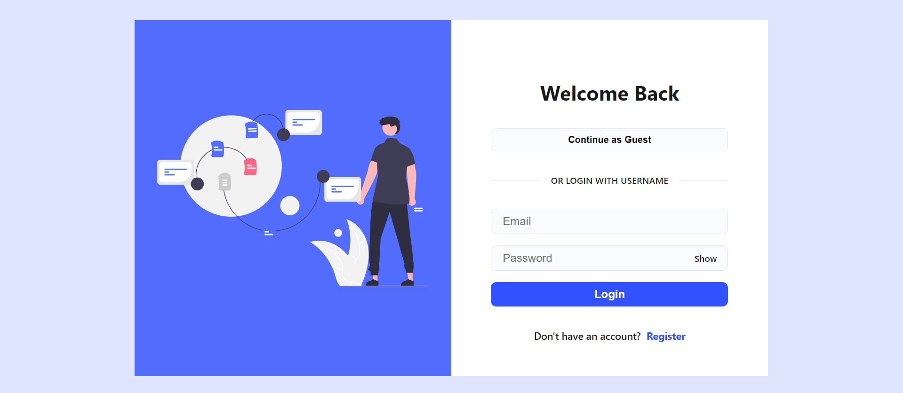
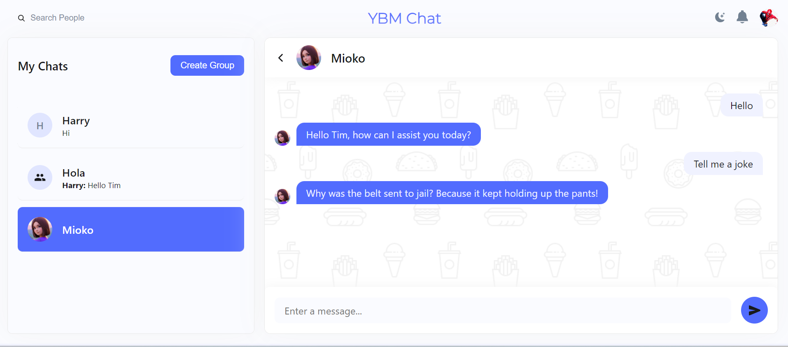
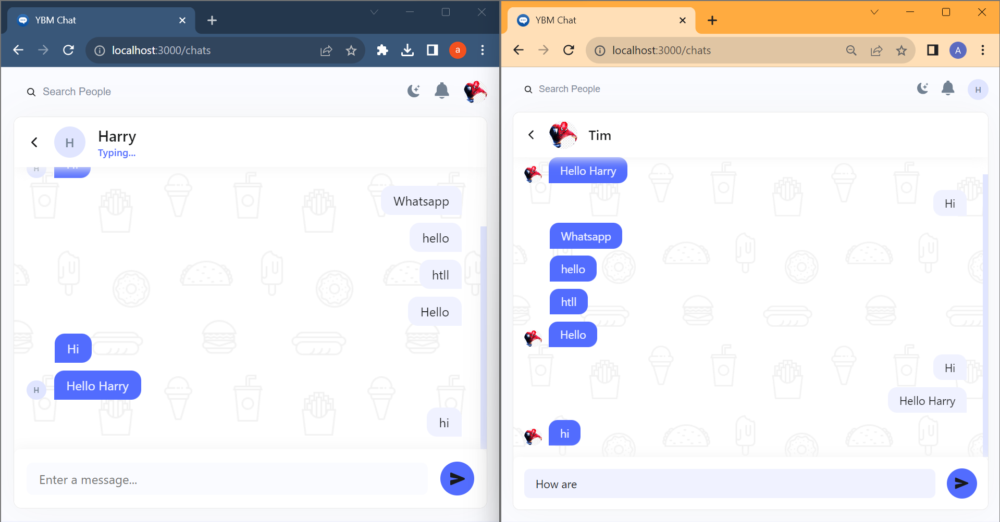
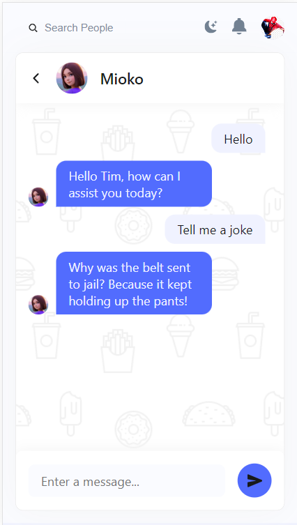
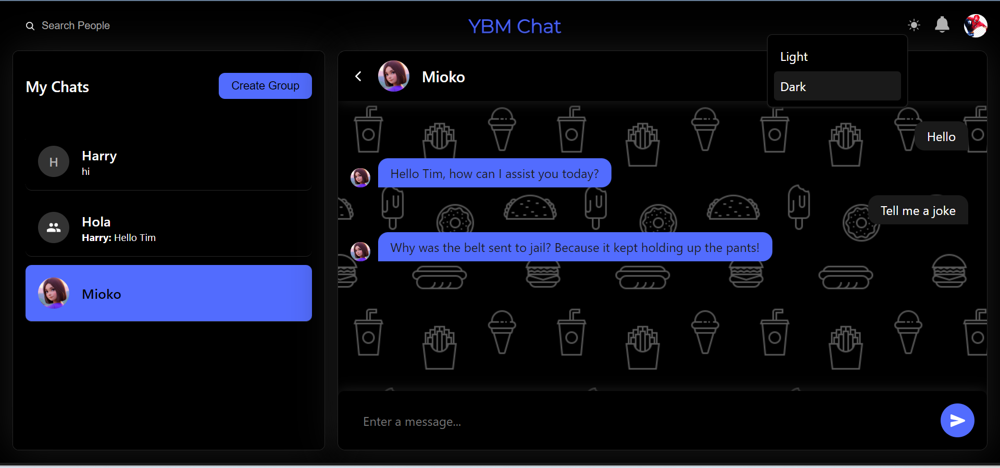

## IBY-Project Real-time-chat-app

This real-time chat application utilizes the MERN stack with MongoDB for flexible data storage. It offers one-to-one and group chatting, real-time typing status, and interaction with the AI chatbot(Mioko). The tech stack includes ReactJS for the client, Express.js for the server, socket.io for real-time communication, and JWT for authentication.

- Visit <https://mioko-chat.netlify.app>
- System-design-doc <https://docs.google.com/document/d/1co_2fTJBtwdriWVUoYpdFRbENUQh81rJHvgBwFk43_g/edit?usp=sharing>

---

### Name - Abhay Mittal

### University - IIT (ISM) Dhanbad

### Department - Computer Science and Engineering

## Tech Stack Used

- **M**ongo DB
- **N**ode JS
- **E**xpress JS
- **R**eact JS
- **S**ocket.io

### Features

- Authentication
- Real-time chat
- Real-time Notification
- Typing indicator
- Group chat
- One-on-one chat
- Responsive
- AI Chat (Mioko)

---

#### Demo

#### Login Page;

## 

#### AI Chat (Mioko)

## 

#### RealTimeChat(with real time typing status)

## 

#### Responsive design

## 

#### Dark theme

## 
